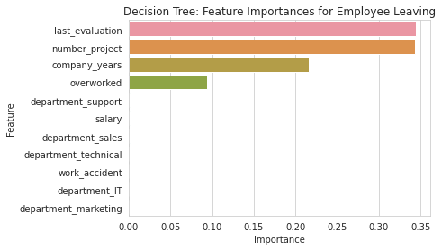
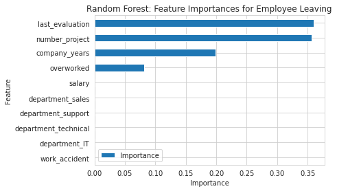

# Google Data Analytics Capstone: William Aidan Whyte

## Project Overview
The HR department at a company called Salifort Motors wants to take some initiatives to improve employee satisfaction levels at the company. They collected data from employees, but don’t know what to do with it. They refer to me as a data analytics professional, and ask me to provide data-driven suggestions based on my understanding of the data. They have the following question: what’s likely to make the employee leave the company?

My goals for this project are to analyze the data collected by the HR department, and to build a model that predicts whether or not an employee will leave the company.

I feel that if I can predict employees likely to quit, it might be possible to identify factors that contribute to their leaving. Because it is time-consuming and expensive to find, interview, and hire new employees, I know that increasing employee retention will be beneficial to the company.

## Visual Insights
Below are the most important factors my models predict are contributing to employee dissatisfaction:

## Detailed Documentation
* **Full Technical Report:** [Interactive Jupyter Notebook](./notebooks/Capstone_Notebook.ipynb)
* **Clean Source Code:** [Python Script/Clean Notebook](./notebooks/Source_Code.ipynb)
