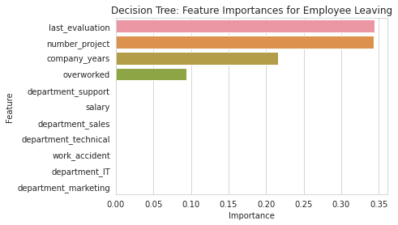
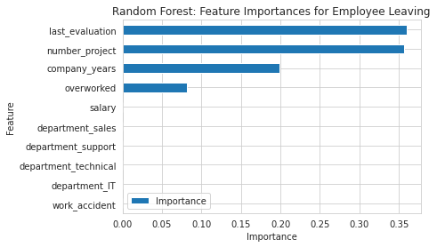

# Employee Attrition Prediction – Salifort Motors
## Executive Summary

Instead of relying on default classification thresholds, I evaluated model performance using precision–recall metrics and implemented a cost-based decision framework. By assigning estimated costs to employee turnover and retention interventions, I identified the threshold that maximizes expected net value. This approach transforms the model from a predictive tool into a decision-support system, enabling more effective allocation of retention resources.

## Business Problem

Salifort Motors is experiencing employee attrition, leading to increased costs from recruiting, onboarding, and lost productivity. The objective of this project is to:

- Identify key drivers of employee turnover
- Predict which employees are at risk of leaving
- Recommend actionable strategies to reduce attrition

## Data

- Dataset: ~15,000 employee records
- Features: satisfaction level, number of projects, average monthly hours, tenure, promotions, salary level, department
- Target variable: left (1 = employee left, 0 = stayed)
- Class distribution: ~16.6% attrition (imbalanced dataset)

## Methods

- Data cleaning and preprocessing (duplicates removed, categorical encoding)
- Exploratory Data Analysis (EDA) to identify behavioral patterns
- Feature engineering (including workload indicators)
- Model training:
  - Decision Tree (baseline)
  - Random Forest (final model)
- Hyperparameter tuning via GridSearchCV
- Evaluation metrics:
  - ROC-AUC (using predicted probabilities)
  - Precision, Recall, F1-score
  - Precision–Recall curve and PR-AUC
- Threshold tuning:
  - Compared precision/recall tradeoffs across thresholds
  - Selected threshold based on business value optimization

## Key Results

- Random Forest outperformed Decision Tree in predictive performance
- Key drivers of attrition:
  - High workload (hours and project count)
  - Low satisfaction levels
  - Lack of promotion
- Precision–recall analysis revealed that default thresholds underperform in identifying at-risk employees
- Optimal classification threshold differs from 0.5 when accounting for business costs

## Business Impact & Decision Framework

To move beyond prediction, I translated model outputs into a decision-making framework:

- Assumptions:
  - Cost of losing an employee (recruiting, onboarding, lost productivity)
  - Cost of retention intervention (e.g., workload adjustment, bonuses)
- For each threshold, I estimated:
  - Employees correctly identified as at risk (true positives)
  - Employees unnecessarily targeted (false positives)
  - Employees missed (false negatives)
- Result:
  - Identified a threshold that maximizes expected net value
  - Demonstrated how model predictions can guide resource allocation decisions

## Recommendations

Based on the analysis:

- Monitor employees with high workload and multiple projects
- Implement early intervention strategies for at-risk employees
- Increase promotion transparency and career development opportunities
- Use model-driven thresholds to prioritize retention efforts

## Project Structure

- notebooks/ – analysis and modeling notebooks
- images/ – visualizations used in the project

## Tools & Technologies

- Python (pandas, numpy, scikit-learn)
- Matplotlib / Seaborn
- Jupyter Notebook

## Notes

- Cost assumptions used in the decision model are illustrative and can be adjusted to reflect real business conditions
- The framework is adaptable to other churn or attrition problems

## Visual Insights
Below are the most important factors my models predict are contributing to employee dissatisfaction:

## Detailed Documentation
* **Full Technical Report:** [Interactive Jupyter Notebook](./notebooks/Capstone_Notebook.ipynb)
* **Clean Source Code:** [Python Script/Clean Notebook](./notebooks/Source_Code.ipynb)
